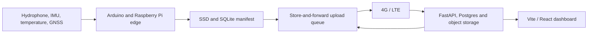

<div align="center">


<br />

<strong>Offline-first coastal sensing and monitoring across embedded acquisition, local raw-data retention, cellular telemetry, backend ingestion and a live dashboard.</strong>

<br /><br />


</div>

---

## `> summary`

This repository contains the software stack for a first-generation coastal-monitoring prototype developed as a UCL MEng final design project.

Within a five-person multidisciplinary team, Priestly Adejo led the software and electronics work:

- embedded sensor integration;
- Raspberry Pi edge services;
- Arduino IMU firmware;
- local acoustic and sensor-data retention;
- store-and-forward file transfer;
- 4G/LTE health and position telemetry;
- FastAPI ingestion and backend state;
- Vite/React monitoring dashboard;
- shared JSON Schema contracts across Python and TypeScript.

The architecture is deliberately offline-first. Losing the cellular connection must not mean losing the raw measurement.

---

## `> system`



The hydrophone and lower-rate sensors are recorded locally. Telemetry and queued payloads move to shore when connectivity is available, and upload acknowledgement returns to the edge manifest.

---

## `> measured_evidence`

| Evidence | Result |
|---|---|
| Field upload delivery | 99.9% |
| Files acknowledged | 52 |
| Files pending at end of window | 0 |
| Measured SSD write speed | 226 MB/s |
| Mean IMU peak-frequency error | 4.7% |
| Supervised field window | 2 hours |
| Estimated continuous endurance at measured load | approximately 23 hours |

The approximately 23-hour figure is a projection from measured power consumption, not the duration of the coastal field test.

---

## `> boundaries`

The prototype demonstrated:

- integrated multi-sensor operation;
- continuous local recording during tested windows;
- LTE monitoring;
- store-and-forward transfer;
- useful dominant-frequency recovery;
- safe supervised coastal deployment.

It did not demonstrate:

- fourteen days of unattended endurance;
- calibrated wave height;
- low-level deep-sea acoustic sensitivity;
- self-righting from complete inversion;
- offshore telemetry beyond cellular coverage;
- production oceanographic readiness.

---

## `> repository_map`

| Path | Purpose |
|---|---|
| `edge/pi/` | Raspberry Pi acquisition, indexing, upload and health services |
| `edge/firmware/` | Arduino Nano 33 BLE Sense Rev 2 firmware |
| `apps/api/` | FastAPI backend and ingestion API |
| `schemas/` | Shared JSON Schema and generated Python/TypeScript contracts |
| `docs/` | Architecture, deployment and hardware documentation |
| repository root | Vite/React dashboard |

---

## `> links`

→ [`portfolio case study`](https://priestlyadejo.com/projects/coastal-buoy)
→ [`full engineering report`](https://priestlyadejo.com/writing/from-sensor-stream-to-shore)
→ [`GitHub profile`](https://github.com/PriestlyAdejo)

---
## Local development (Windows, Conda + Node)

### Prerequisites

- **Conda** (Anaconda or Miniconda). [Download](https://docs.conda.io/en/latest/miniconda.html).
- **Node.js LTS** (for the frontend). [Download](https://nodejs.org/en/download/).
- **Git**.

### 1. Create/update the Conda env (`buoy-dev`)

From repo root (or from `scripts/` — scripts resolve repo root themselves):

```bat
scripts\setup_env_windows.bat
```

Or PowerShell (if execution policy allows, or use `-ExecutionPolicy Bypass`):

```powershell
powershell -NoProfile -ExecutionPolicy Bypass -File .\scripts\setup_env_windows.ps1
```

This will:

- Create Conda env **`buoy-dev`** from `environment.yml` if it doesn’t exist, or update it if it does.
- Install backend and edge Python packages in **editable** mode into `buoy-dev`.
- Install frontend dependencies with `npm install` / `npm ci`.

**Create env only (no pip/npm):**

```bash
conda env create -f environment.yml
```

**Update env after changing `environment.yml`:**

```bash
conda env update -f environment.yml --prune
```

Then run `scripts\setup_env_windows.bat` again to re-run pip editable installs and npm install.

### 2. Interpreter in Cursor / VS Code

- **Do not** commit a hard-coded `python.defaultInterpreterPath` (machine-specific).
- After setup, choose the **`buoy-dev`** interpreter: **Ctrl+Shift+P** → **Python: Select Interpreter** → pick the one named `buoy-dev`.
- The repo’s `.vscode/settings.json` configures analysis paths for `apps/api/src` and `edge/pi/src` so imports resolve.

### 3. Run backend

Backend uses the **`buoy-dev`** Conda env (no need to activate it manually; the script uses `conda run -n buoy-dev`).

```bat
scripts\run_backend_windows.bat
```

- **API base**: http://127.0.0.1:8000/v1  
- **Docs**: http://127.0.0.1:8000/docs  
- **Health**: http://127.0.0.1:8000/v1/healthz  

### 4. Run frontend

Frontend only needs Node/npm (no Conda).

```bat
scripts\run_frontend_windows.bat
```

- **Dashboard**: http://127.0.0.1:5173  

### 5. Run both (two terminals)

```bat
scripts\dev_windows.bat
```

Opens two windows: backend and frontend.

---

## Docker: what it’s for and when it’s optional

**Docker is not required** for normal local UI/API development (frontend + backend dev server). You can run everything with Conda + Node as above.

Docker is used for:

- **Postgres** and **MinIO** (object storage) when you want a full backend stack.
- **Reproducible backend infrastructure** (same DB and S3-compatible storage across machines).
- **CI or production-like** runs.

See **`docker/README.md`** for:

- When to use `docker/compose.backend.yml`.
- How to run Postgres + MinIO for local backend development.
- When Docker is optional vs. useful.

---

## Troubleshooting

| Problem | What to do |
|--------|------------|
| **`npm` not recognized** | Install Node.js LTS; close and reopen the terminal. Ensure Node is on PATH. |
| **Conda not found** | Open **Anaconda Prompt** and run the scripts from there, or add Conda to PATH. |
| **Wrong working directory** | Scripts derive repo root from their own path (`%~dp0..` / `$PSScriptRoot`). Run from any folder under the repo. |
| **Editable install failures** | Run `scripts\setup_env_windows.bat` from repo root. If Python is wrong, ensure Conda env `buoy-dev` exists and is selected. |
| **Interpreter not showing in Cursor** | Reload window; run **Python: Select Interpreter** and pick `buoy-dev`. Conda must be on PATH for the extension to see envs. |
| **PowerShell execution policy** | Run: `powershell -NoProfile -ExecutionPolicy Bypass -File .\scripts\setup_env_windows.ps1` or use the `.bat` scripts. |
| **Backend: uvicorn not found** | Ensure you ran `scripts\setup_env_windows.bat`; the run script uses `conda run -n buoy-dev` so `buoy-dev` must have the backend installed. |

---

## Quick start (dashboard only)

If you only need the frontend and already have Node:

```bash
npm install
npm run dev
```

---

## Development notes

- The dashboard can use mock data; we migrate screens to the backend API over time.
- The Pi stack is **offline-first**: record locally → index → upload when connected.
